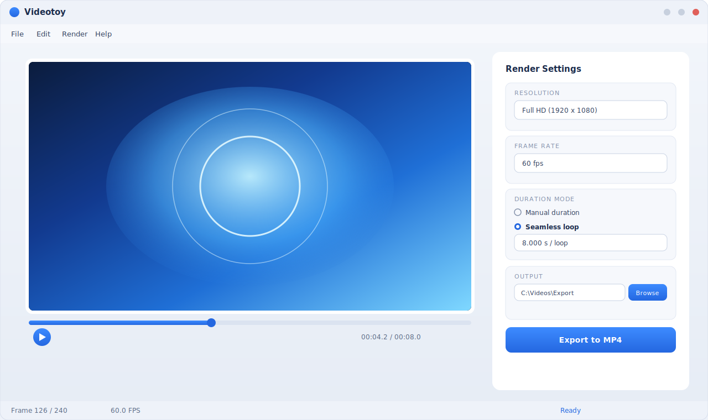

# Videotoy

**Videotoy** is a Windows 11 desktop application that turns a
[Shadertoy](https://www.shadertoy.com) GLSL shader into an MP4 video file,
rendered frame by frame through a fully **deterministic** pipeline — no
dependency on the host machine's real-time performance — and encoded with an
**embedded** copy of `ffmpeg.exe`, so no external tool or dependency needs to
be installed separately.

## Features

### Shader loading

- Open a shader via **File → Open Shader...** or by dragging a file onto the
  preview viewport
- Supports raw GLSL (`.glsl`, `.frag`) as well as full Shadertoy JSON exports
  (`.json`, `.shadertoy`), including multi-pass projects (`Image`,
  `Buffer A/B/C/D`, `Common`)
- Line-numbered parsing/compilation errors and warnings surfaced in a
  dedicated, collapsible **Shader Issues** panel
- Standard Shadertoy uniforms: `iResolution`, `iTime`, `iTimeDelta`,
  `iFrame`, `iMouse`, `iDate`, `iChannel0-3`, `iSampleRate`
- Recently opened shaders remembered across sessions

### Inputs

- Static image textures as `iChannel` inputs
- Audio files (WAV / MP3 / OGG) as `iChannel` audio sources — the
  spectrum/waveform texture Shadertoy shaders expect is regenerated
  **deterministically** from `iTime` for every rendered frame, not sampled
  from real-time playback
- Custom uniforms declared via a lightweight comment convention in the
  shader source (`// uniform: float Speed = 1.0 [0.0, 5.0] "Speed"`),
  exposed as live sliders in the render settings panel for interactive
  preview tuning (the exported video always uses the shader's declared
  defaults)

### Rendering

- GLSL → HLSL transpilation and offscreen Direct3D 11 rendering, with
  automatic WARP (software) fallback when no compatible GPU is available
- Deterministic render clock: `iTime` is derived purely from the frame
  index and the target frame rate, so the exported video is identical
  regardless of the machine's speed
- Full multi-pass support with ping-pong render targets for
  self-referencing feedback buffers (Buffer A/B/C/D)
- Live, real-time preview in a fixed 800×450 viewport with play/pause/stop
  and a scrubbable timeline

### Video export

- Direct MP4 export via an embedded, integrity-checked `ffmpeg.exe`
  (SHA-256 verified at every startup) — frames are streamed straight into
  FFmpeg's stdin pipe, with no intermediate frame files ever written to disk
- Configurable resolution (Preview / SD / HD / Full HD / 4K UHD, dedicated
  4:3, 16:9 and 9:16 (portrait) presets, or fully custom), frame rate
  (24/25/30/60 or custom), codec (H.264/H.265), and rate control (CRF or
  target bitrate)
- **Manual duration** mode (fixed length in seconds or frames) or
  **seamless loop** mode: enter a loop period and Videotoy computes the
  exact frame count for a perfect, jump-free `last frame → first frame`
  loop, with an optional assisted rounding suggestion when the requested
  duration doesn't divide evenly into whole frames, and an optional
  heuristic detection of a shader's own native loop period
- Loop seam preview: side-by-side comparison of the loop's first and last
  rendered frame, to validate the seam before committing to a full export
- Live estimate of the total frame count and output file size as settings
  change
- Progress bar with current/total frame counter and remaining-time
  estimate, plus clean cancellation (FFmpeg process is killed and cleaned
  up immediately)
- "Low-spec mode": throttled, strictly sequential rendering with no
  dropped or reordered frame, for modest hardware
- Save and reload named export presets (resolution, frame rate, duration
  mode, low-spec mode)
- Automatic audio muxing when the shader declares an audio `iChannel`: the
  source audio track is encoded and muxed together with the video in a
  single FFmpeg pass, strictly aligned on the same deterministic timeline
  (same `t = 0` origin, same duration, including at a seamless loop's seam)

### Interface

- Custom, chromeless window with the Windows 11 Mica backdrop, rounded
  corners, and a single light theme
- Retractable render settings panel, toast notifications, animated splash
  screen, and an animated Edit ↔ Export mode transition
- Full French / English localization with hot language switching (no
  restart required), selectable from the **About** window
- **About** window with the application name, current SemVer version,
  copyright, contact e-mail and website

## Installation

Download the latest installer from the
[Releases](https://github.com/patrickjaillet/Videotoy/releases) page and run
it. FFmpeg is bundled with the installer — no additional dependency needs to
be installed separately. Videotoy targets **Windows 11** only.

## Usage

1. Launch Videotoy and open a shader (**File → Open Shader...**, or drag a
   `.glsl` / `.frag` / `.json` / `.shadertoy` file onto the preview
   viewport).
2. Use the live preview (play/pause, scrub the timeline) to check the
   shader, and adjust any custom uniforms exposed by it.
3. Open the **Render Settings** panel to configure resolution, frame rate,
   codec, and the export duration — either a manual length or a seamless
   loop period.
4. Pick an output folder and file name, then start the export from
   **Render → Export to MP4...** (or the panel's export button). Progress,
   remaining time and cancellation are available while the video renders.

## Building from source

See [COMPILATION.md](COMPILATION.md) for build prerequisites, the FFmpeg
embedding step, and how to generate the Inno Setup installer.

## Website

https://patrickjaillet.github.io/Videotoy

## License

MIT — see [LICENSE](LICENSE).

## Author

Patrick JAILLET — sandefjord.development@proton.me
